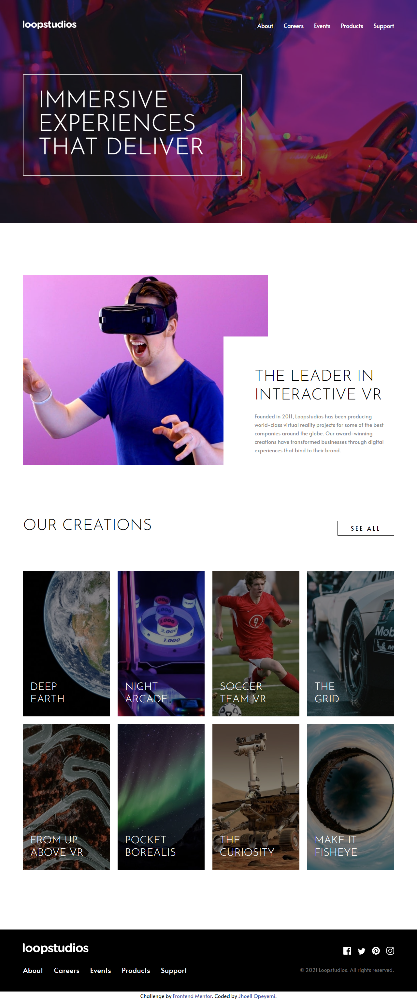

# Frontend Mentor - Loopstudios landing page solution

This is a solution to the [Loopstudios landing page challenge on Frontend Mentor](https://www.frontendmentor.io/challenges/loopstudios-landing-page-N88J5Onjw). Frontend Mentor challenges help you improve your coding skills by building realistic projects.

## Table of contents

- [Overview](#overview)
  - [The challenge](#the-challenge)
  - [Screenshot](#screenshot)
  - [Links](#links)
- [My process](#my-process)
  - [Built with](#built-with)
  - [What I learned](#what-i-learned)
  - [Useful resources](#useful-resources)
- [Author](#author)

## Overview

### The challenge

Users should be able to:

- View the optimal layout for the site depending on their device's screen size
- See hover states for all interactive elements on the page

### Screenshot

### Links

- Solution URL: [Solution](https://www.frontendmentor.io/solutions/mobile-first-responsive-landing-page-using-css-grid-w-8qjatXm)
- Live Site URL: [Live Site](https://jhoell-loopstudio-landing-page.netlify.app/)

## My process

### Built with

- Semantic HTML5 markup
- CSS custom properties
- Flexbox
- CSS Grid
- Mobile-first workflow

### What I learned

I learned about the concept of CSS prefers-reduced-motion media query while doing this project. And I also learned how to make a preloader which is not part of the challenge objectives but I just wanted to 'explore'.

### Useful resources

- [MDN](https://developer.mozilla.org/en-US/docs/Web/CSS/@media/prefers-reduced-motion) - This helped me understand the concept of prefers-reduced-motion

## Author

- Frontend Mentor - [@JhoellOpeyemi](https://www.frontendmentor.io/profile/JhoellOpeyemi)
- Twitter - [@iam_jhoell](https://www.twitter.com/iam_jhoell)
